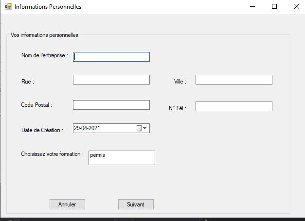

# 
Projet1 E4 

## Sommaire
1. [Presentation](#presentation)
2. [Inscription](#Inscription)

## Presentation 
Le but de ce projet est de permettre à l'utilisateur de s'inscrire et de se connecter. Une fois connecté, il saisit des informations qui seront enregistrés dans la base de données, avec un récapitulatif de tous nos choix à la fin.

## Inscription
***
* Le formulaire d'inscription  
 
* Vérification si les mots de passes correspondent ou pas 
 
* Le code de la page inscription   
 

## Connexion 
***
Une fois inscrit, nous sommes redirigés vers la page connexion.

* Le formulaire de connexion
 
* Le test de la page de connexion en se référant aux éléments de la BDD
 
* Le code de la page connexion   
 

## Information Personnelle
*** 
Une fois connecté, le membre peut commencer à saisir des informations le concernant

* Le formulaire d'informations personnelle
 

*Lorsque la personne a entré ses informations, je voudrais lui faire une richTextBox avec un récapitulatif de ses informations puis qu'elle valide si ça lui semble correct ou  de modifier en cas d'erreur*